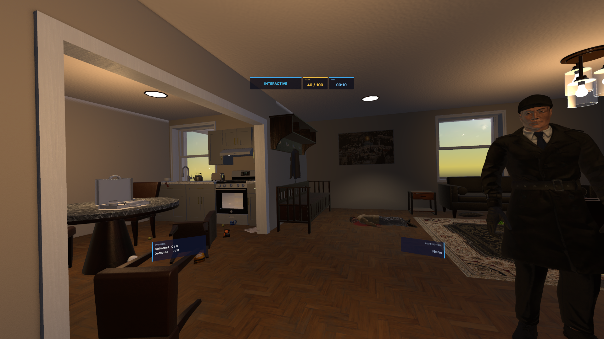
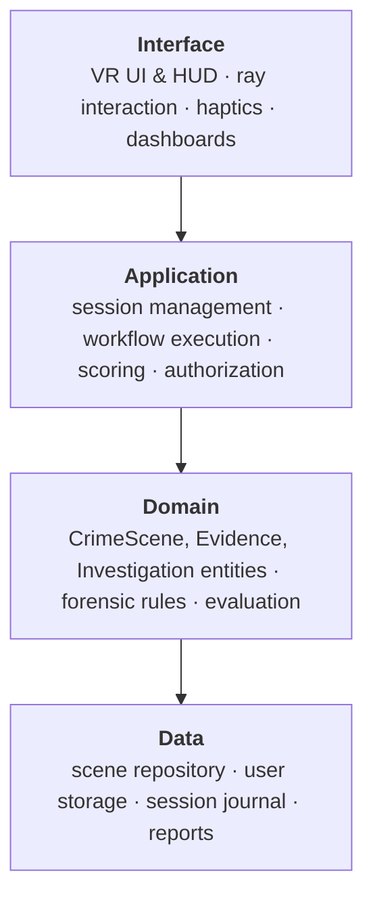
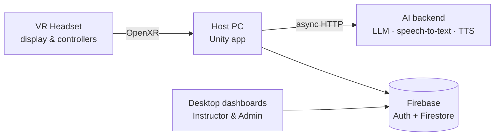
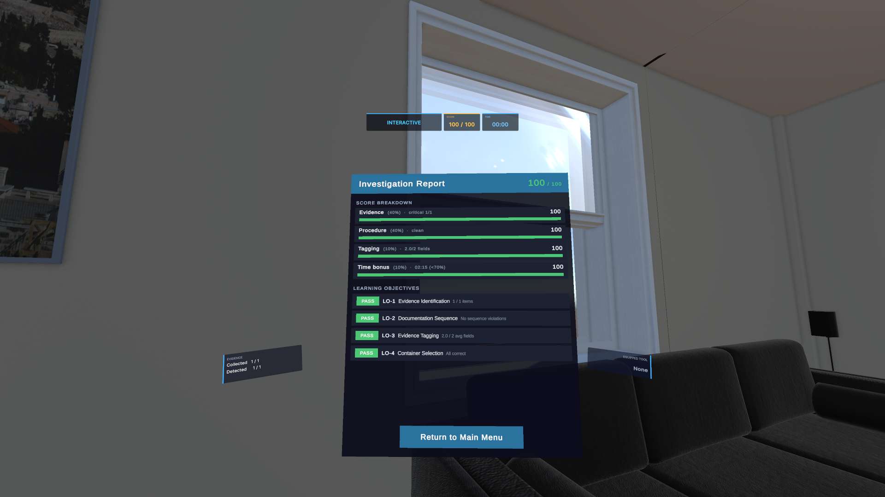
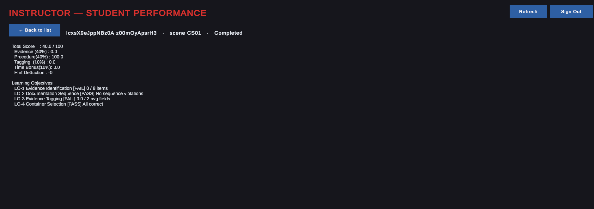
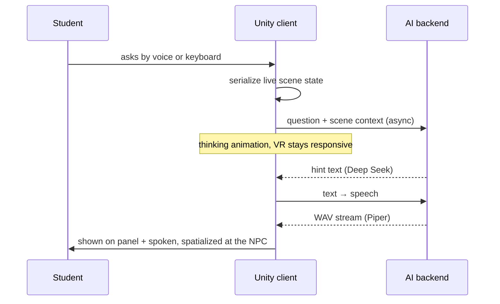
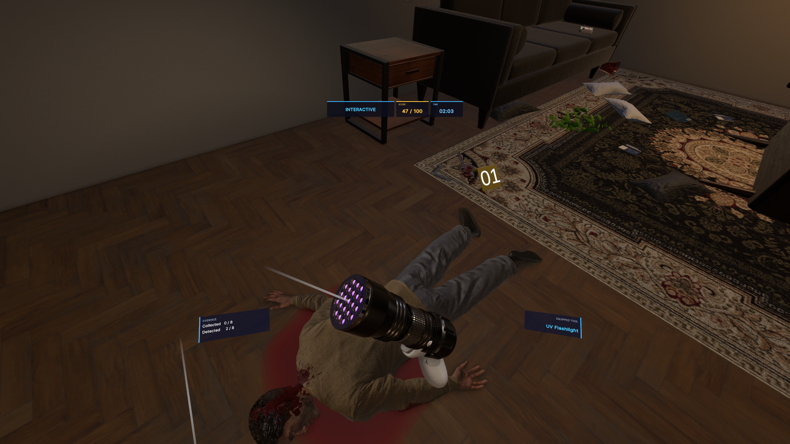
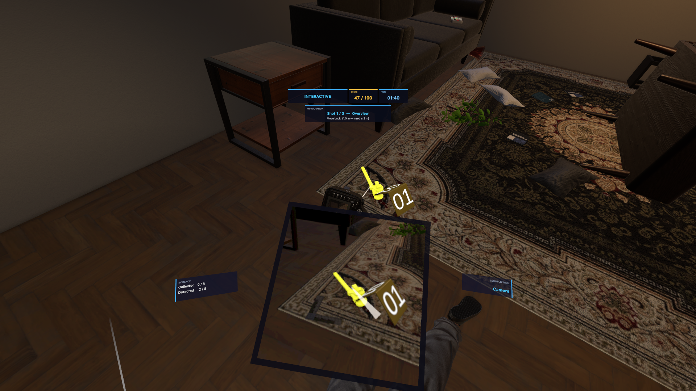
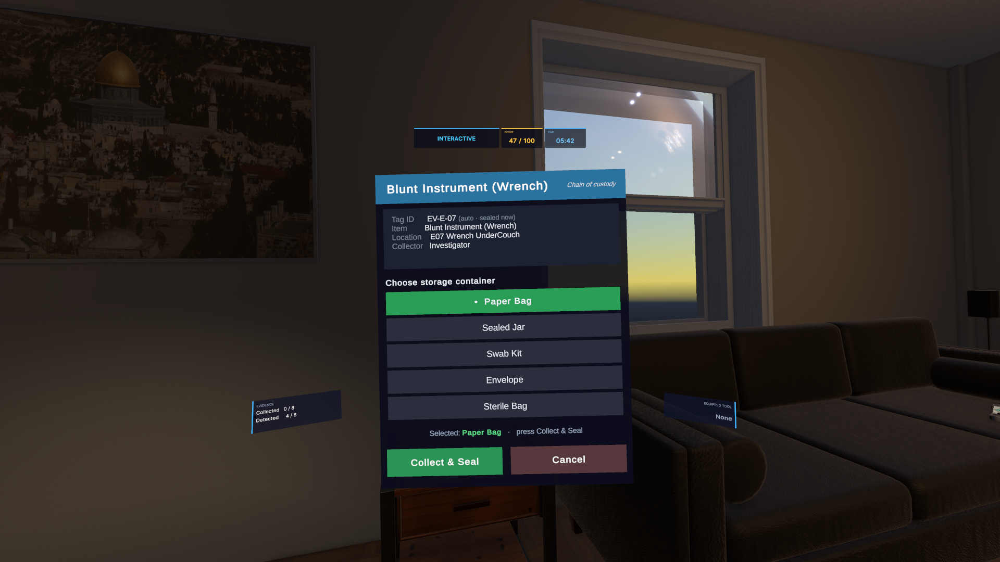

# Crime-Scene-Virtual-Reality-Simulation
**A VR training platform for the complete forensic evidence-handling workflow.**
Students walk into a crime scene, find the evidence, and have to mark, photograph, collect, and tag them in the correct order, while the system scores every action and reports back to their instructor.

> **About this repository:** this is a project showcase. The source code is private (university graduation project), so this repo documents the design, architecture, and engineering decisions instead.

[**Watch the demo video**](https://drive.google.com/file/d/14RORcuggJtpwJygkFgn5tCGMQEvWoO2h/view?usp=share_link)



<p align="center">
  <b>Unity 6</b> · <b>C#</b> · <b>OpenXR</b> · <b>XR Interaction Toolkit</b> · <b>Firebase Auth</b> · <b>Cloud Firestore</b> · <b>Deep Seek</b> · <b>Piper TTS</b> · <b>Blender</b>
</p>

---

## The problem

Most forensic science students first touch a real crime scene on the job. Traditional training has four gaps:

| | |
|---|---|
| **No Safe Practice** | a single procedural mistake can compromise a real case. Students get no room to rehearse. |
| **Prohibitive Cost** | physical mock scenes cost money, space, and setup time |
| **Low immersion** | lectures and photos teach theory, not practice |
| **No Scalability** | no two students face the same test – no consistent, repeatable assessment. |

## The solution

A VR simulator where the procedure itself is enforced by the software, so students can only progress by doing things the right way, and every session produces a measurable result.

- **Immersive crime scene:** a photorealistic apartment with a coherent forensic story (9 evidence items across biological, trace, physical, and chemical categories, 3 of them latent and visible only under UV).
- **Full forensic workflow:** observe → mark → photograph → inspect → collect → tag.
- **Forensic toolkit:** evidence markers, measurement scale, a three-stage camera, UV flashlight, and a fingerprint kit.
- **Live scoring and reports:** a rubric score that updates on every action, an in-headset report, and an instructor dashboard.
- **AI forensic advisor:** an in-scene NPC that students can question by voice or keyboard.
- **Randomized evidence placement:** select items have a set of possible placements, so every session is a fresh search.
- **Crash-safe sessions:** a session interrupted by a crash or force-quit resumes exactly where it stopped.
- **Two learning modes and three roles:** Observational and Interactive Investigation modes; Student, Instructor, and Administrator interfaces from a single build.

---

## Architecture

The system follows a four-layer architecture built around a clear separation of concerns. VR-specific code is kept separate from forensic rules, while the domain layer remains independent of both rendering and storage. This separation reduces coupling between layers, allowing changes in one part of the system to have minimal impact on the others.



### Deployment



At sign-in, Firebase Auth resolves the user's role from their profile, and the role decides which interface loads: the VR investigation for students, or the desktop dashboards for instructors and admins.

<!-- Optional: add the class / component diagrams from the report here -->
<!--  -->

---

## Engineering highlights

### 1. Evidence lifecycle state machine

Every evidence item runs its own five-state machine, and every transition is guarded, so a student physically cannot skip a step.


The same state machine is the single source of truth for gameplay, HUD feedback, violation tracking, and scoring. Out-of-order attempts (e.g. trying to collect an item that hasn't been photographed) are blocked and recorded as procedural violations rather than silently ignored.

### 2. Crash durability with an append-only journal

VR sessions can end abruptly: a headset disconnects, the app crashes, or the student quits. Losing a 15-minute investigation to that is unacceptable, but writing to Firestore on every action would add network latency to gameplay. The design separates the two concerns:

```
play → in-memory buffer + local journal → session end → one batched Firestore write → journal deleted
                                  ↘ crash? journal survives → "Resume Investigation" on relaunch
```

- **Performance:** no per-action network writes during play. Actions buffer in memory and are flushed to Firestore in a single batch when the session ends.
- **Durability:** every event is fsync-appended to a local journal, so it's on disk before the next frame.
- **Recovery:** on relaunch the menu offers *Resume Investigation*, which replays the journal and rebuilds the session exactly: the same randomized evidence layout, every item's lifecycle state, placed markers and their numbers, the chain-of-custody timeline, the live score and rubric progress, and the elapsed time (excluding the idle gap while the app was closed).

### 3. Weighted, event-driven scoring

```
Total = 0.40·Evidence + 0.40·Procedure + 0.10·Tagging + 0.10·Time − 2·Hints
```

Clamped to 0–100, recomputed on every event, with critical evidence (like the murder weapon) counting double. The time bonus is tiered and only rewards finishing under the benchmark; it never subtracts. On top of the numeric score, four pass/fail **learning objectives** (evidence identification & collection, documentation sequence, tagging, container selection) are reported like achievements. The mechanics reward following forensic procedure; they never bend it.

| In-headset report | Instructor dashboard |
|---|---|
|  |  |

### 4. Non-blocking AI forensic advisor

An NPC advisor answers questions by voice or keyboard and speaks its reply in the scene, without ever freezing the VR experience.



- **Separate backend service:** one endpoint hosts the language, speech-recognition, and speech-synthesis models. It also keeps API credentials on the server rather than baked into the distributed build.
- **Scene-aware answers:** before each question, the client rebuilds a fresh description of the scene from the live evidence registry (progress, each item's status, type, and location, plus the correct procedural order), so hints always match where the student actually is.
- **Fully asynchronous:** requests run through coroutine-based web requests; the returned WAV is decoded in memory into an `AudioClip` with no disk writes.
- **Pedagogically constrained:** the advisor points students in the right direction without giving the answer, and each question costs 2 points.
- **Graceful failure:** if the backend is unreachable, the advisor reports it and the investigation continues normally.

### 5. Randomized evidence placement

To stop students memorizing locations across runs, each item can have several pre-placed candidate positions authored directly in the Unity scene under an `EvidenceSpawnGroup`. At session start, one variant is enabled and the rest are disabled; the murder weapon, for example, spawns in one of three spots. The chosen variant is persisted with the session, which is what lets crash recovery restore the identical layout.

### 6. Chain of custody

Collection is gated on documentation: the collect prompt only appears once an item has been photographed. Students must pick the correct container (blood goes in a swab kit; a wrong choice blocks collection and records an error), the tag auto-fills ID, description, location, timestamp, and collector, and every transfer is written to an append-only custody timeline for the session.

### 7. Role-based access from one build

Firebase email/password authentication, with the user's role stored on their profile. All backend access goes through a layered, fully async data architecture (**Services → Repositories → Models**) rather than Firebase calls scattered through gameplay code.

---

## The forensic toolkit

All tools live in a radial menu; students point the thumbstick at a tool to equip it, one at a time.

| Tool | What it does |
|---|---|
| **Evidence marker** | numbered tent cards for floors, adhesive tags for walls, numbered automatically |
| **Measurement scale** | an L-scale placed beside evidence so photos have a size reference |
| **Virtual camera** | live render-texture viewfinder; validates framing, distance, and marked state before accepting a shot, supporting three-stage forensic photography |
| **UV flashlight** | real range and cone angle; latent traces fluoresce and then enter the normal evidence lifecycle |
| **Fingerprint kit** | dust, then tape-lift, in a fixed order, each step with its own haptic feedback and score |

<!-- Suggested: a row of screenshots -->
| UV reveals a latent print | Camera framing marked evidence | Tagging panel |
|---|---|---|
|  |  |  |

---

## Testing

Structured manual test cases run on the real PC-VR setup, each with steps, expected result, actual result, and pass/fail.

| ID | Scenario | Type | Result |
|---|---|---|---|
| TC-01 | Ask the NPC by voice input | Positive | ✅ Pass |
| TC-02 | Ask via the virtual keyboard | Alt. input | ✅ Pass |
| TC-03 | Hint request does not block VR interaction | Non-blocking | ✅ Pass |
| TC-04 | NPC request when the backend is unreachable | Negative | ✅ Pass |
| TC-05 | Full document-then-collect flow | Positive | ✅ Pass |
| TC-06 | Collect before photography (blocked) | Negative | ✅ Pass |
| TC-07 | Photograph before marker (shot rejected) | Negative | ✅ Pass |
| TC-08 | Advanced mode selected, scene loads | Positive | ✅ Pass |
| TC-09 | Base mode, evidence interaction disabled | Positive | ✅ Pass |
| TC-10 | Start pressed repeatedly, no duplicate load | Negative | ✅ Pass |

The four negative cases confirm the system actively blocks invalid or out-of-order actions. Crash recovery was verified separately by force-quitting mid-investigation and confirming the resumed session matched the pre-crash state.

---

## Team

Built as a graduation project at **Birzeit University, Department of Computer Science** (2025–2026).

- **Tasneem Abu Sara**
- Osayed Zaheda
- Hanan Naji

Supervised by **Dr. Sobhi Ahmad**.

[Read the full project report](https://drive.google.com/file/d/1VaOlJNucDdBVWFdRTFg4if3Q3gBwl1_f/view?usp=sharing)

## Future work

- Structured user studies with forensic science students to measure the impact on engagement and procedural accuracy
- Additional crime scenes and scenarios
- Performance optimization
